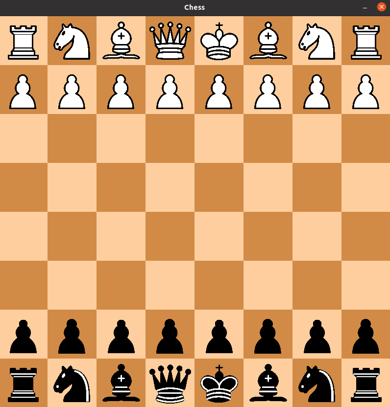
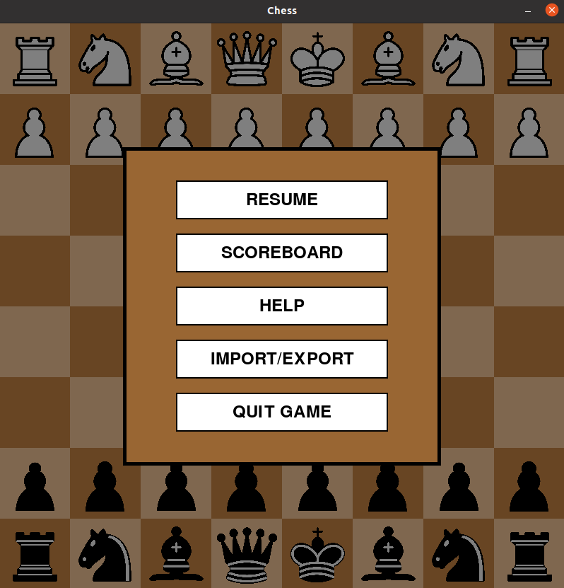
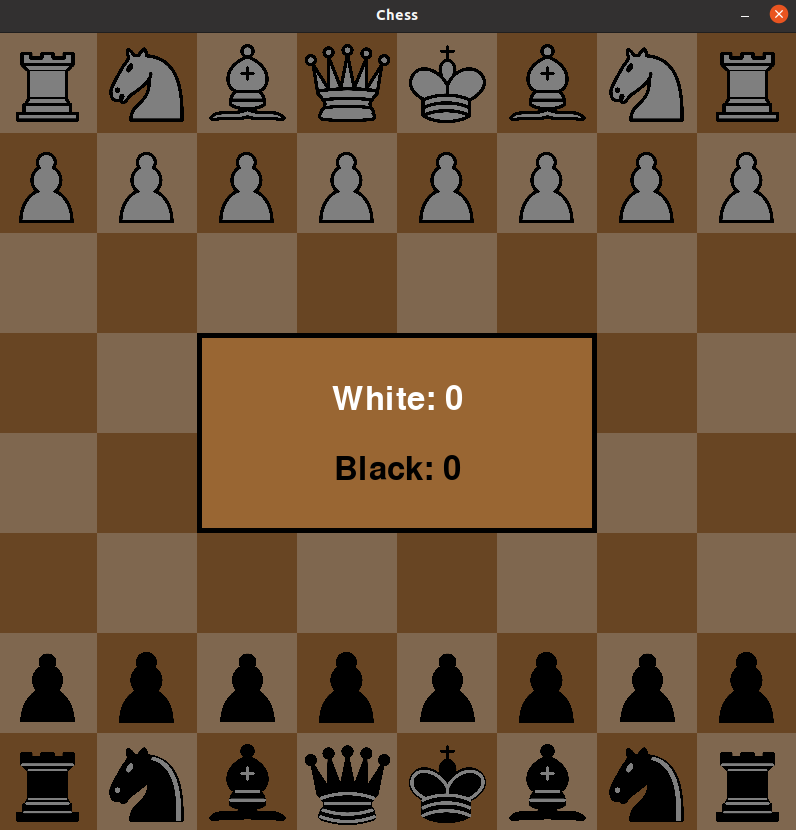

# Simple Python Chess by alexfacehead

This is a simple chess game implemented in Python that is actively maintained as of April 5 2023. It supports networked local or online multiplayer, although it currently does not support en passant or pawn promotion. These features are planned for future implementation. The main menu, however, features an import/export feature, a place to enter your network address (IP), and a scoreboard.

Enjoy this minimalistic chess game!

## How to Play
- Utilize the help menu if you do not know the rules of chess (TBA)
- Press `Resume` to begin the game or to return from the pause screen
- Press the `ESC` key to open the menu

## Features
- Pull up the main menu with `ESC`
     - Main menu that has `Resume`, `Scoreboard`, `Help`, and `Import/Export` buttons
        - Help menu - TBA
        - Import/Export functionality - TBA
- Scoreboard displayed in dark text for both sides, just pull up the menu and press `Scoreboard`
- Blue highlighting for selected pieces
- Undo *any* move using the `u` key
- Piece logic for all moves except en passant
- Turn-based gameplay with no easy cheatings
- Implements castling perfectly!
- Pawn promotion DISABLED for now
- Very visually familiar board
- A variation on chess pieces contained in /images_copy/

## Installation Instructions

### For Windows:
1. Ensure you have Python installed on your system.
2. Install `pip` for Windows by following the instructions at https://pip.pypa.io/en/stable/installation/.
3. Run `game.exe` in the `/python_chess/dist/` folder.

### For Linux:
1. Ensure you have Python installed on your system.
2. Install `pip` for Linux by running `sudo apt install python3-pip` (for Debian/Ubuntu-based systems) or `sudo yum install python3-pip` (for RHEL/Fedora-based systems).
3. Install the `pygame` library using `pip install pygame`.
4. Make the `run_game.sh` script executable by running `chmod +x run_game.sh`.
5. Execute the script using `./run_game.sh` and enjoy the game!

### For Mac:
1. Ensure you have Python installed on your system.
2. Install `pip` for macOS by following the instructions at https://pip.pypa.io/en/stable/installation/.
3. Install the `pygame` library using `pip install pygame`.
4. Make the `run_game.sh` script executable by running `chmod +x run_game.sh`.
5. Execute the script using `./run_game.sh` and enjoy the game!

This README was optimized by GPT-4.
