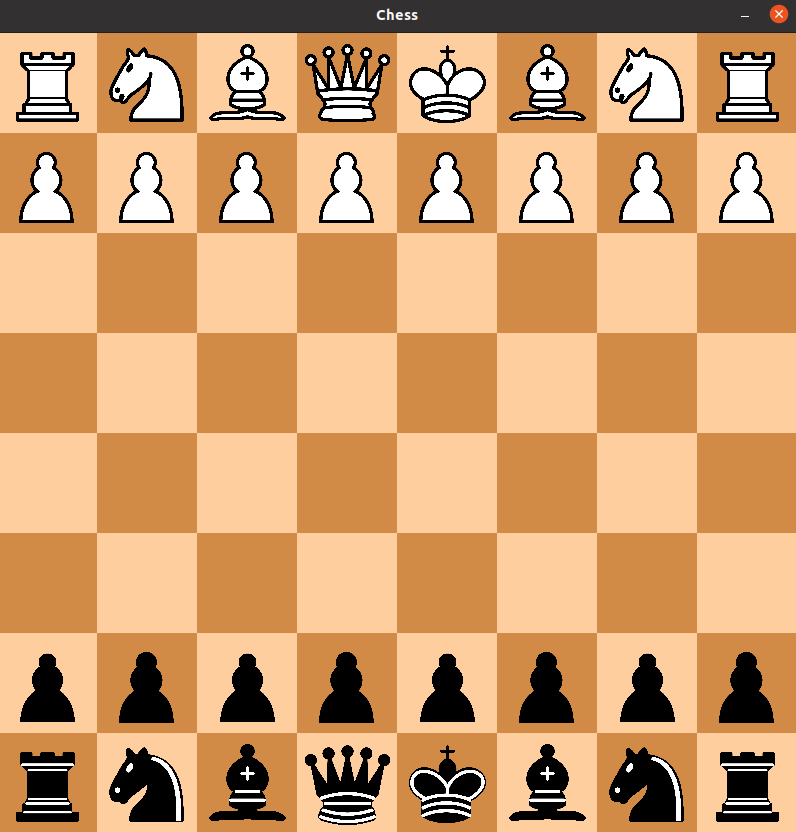

# Simple Python Chess by alexfacehead

This is a simple chess game implemented in Python that is actively maintained as of April 2 2023. It currently does not support en passant or pawn promotion. These features are planned for future implementation, and any advice on simplifying modularization is welcome. Enjoy this minimalistic chess game!

## Features
- Scoreboard displayed in red for both sides
- Yellow highlighting for selected pieces
- Undo any move using the `u` key
- Piece logic for all moves except en passant
- Turn-based gameplay with no cheating allowed
- Implements castling perfectly!
- Pawn promotion disabled for now
- Very visually familiar board

## Installation Instructions

### For Windows:
1. Ensure you have Python installed on your system.
2. Ensure you have `pip` installed for Windows (skip to step 3 if you already have it).
3. Run `game.exe` in the `/python_chess/dist/` folder.

### For Linux:
1. Ensure you have Python installed on your system.
2. Ensure you have `pip` installed (skip to step 3 if you already have it).
3. Install the `pygame` library using `pip install pygame`.
4. Make the `run_game.sh` script executable by running `chmod +x run_game.sh`.
5. Execute the script using `./run_game.sh` and enjoy the game!

This README was optimized by GPT-4.