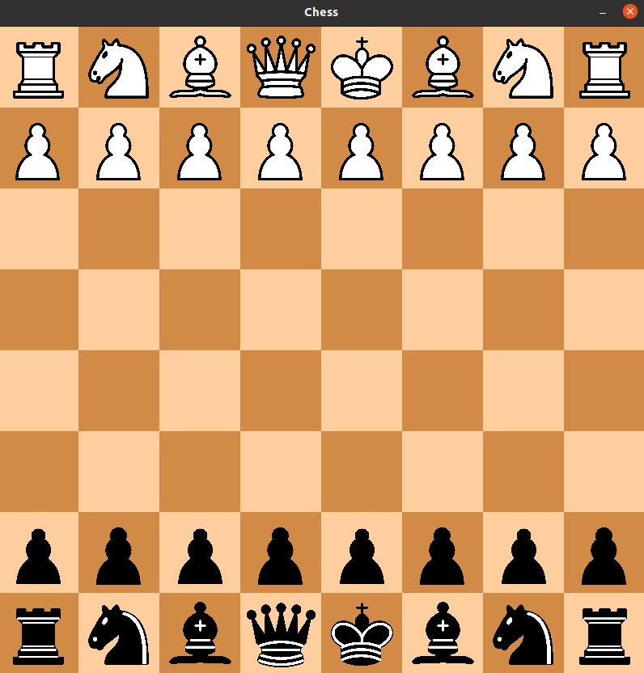
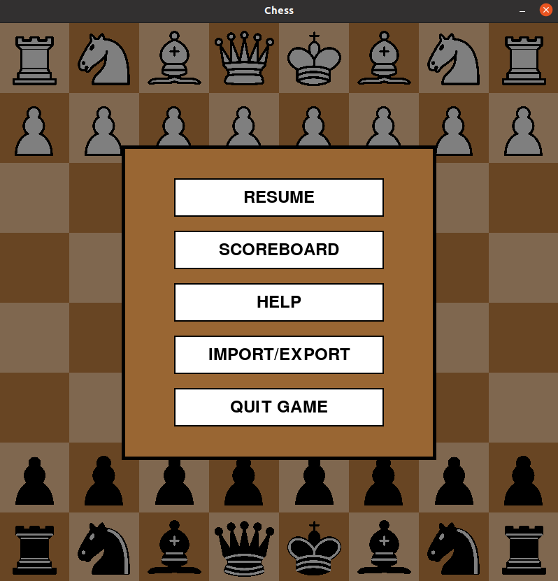
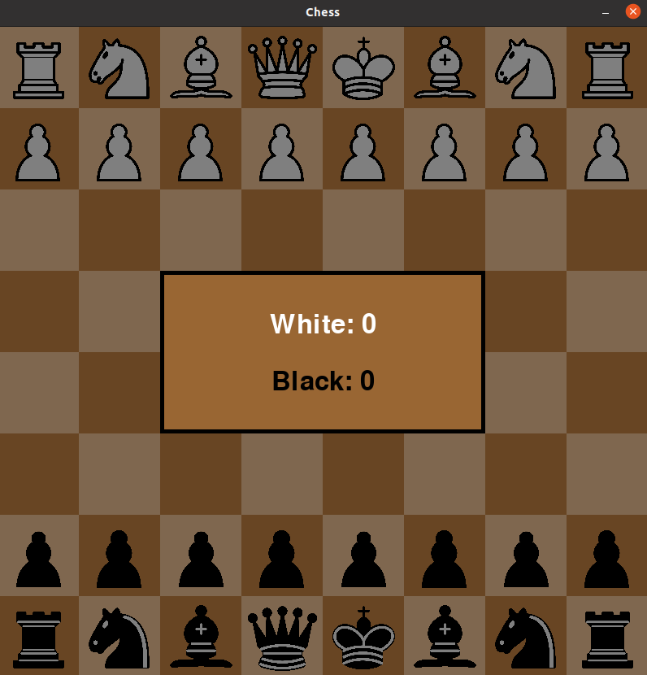

# Simple Python Chess by alexfacehead

A chess game implemented in Python with Pygame. Supports local and networked multiplayer with full chess rule enforcement including en passant, castling, pawn promotion, and check/checkmate/stalemate detection.





## How to Play
- Press `ESC` to open the main menu
- Press `RESUME` to begin or return to the game
- Click a piece to select it (green highlight), then click a destination to move
- Press `U` to undo the last move

## Features
- Full piece movement logic for all standard chess rules
- En passant captures
- Kingside and queenside castling (with full validation: path clear, no moving through check)
- Pawn promotion (auto-promotes to queen)
- Check, checkmate, and stalemate detection with on-screen display
- Turn indicator and check warnings displayed during play
- Scoreboard tracking captured piece values
- Move import/export in algebraic notation
- Undo any move with `U`
- Networked multiplayer via TCP (configure IP in the Network menu)
- Main menu with `RESUME`, `NEW GAME`, `SCOREBOARD`, `NETWORK`, `IMPORT/EXPORT`, and `QUIT GAME`
- Green highlighting for selected pieces
- Light/dark piece sprites matched to board square color

## Installation

### Requirements
- Python 3.8+
- `pip install pygame pyperclip`

### Running
```bash
chmod +x run_game.sh
./run_game.sh
```
Or directly:
```bash
python game.py
```

### Networked Play
1. Open the `NETWORK` menu from the main menu
2. Enter the host's IP address and press `ENTER`
3. The host should run `python server.py` and ensure port 5555 is accessible
4. For LAN play, use internal IP addresses; for internet play, the host needs port forwarding on port 5555

## Testing
```bash
pip install pytest
python -m pytest test_chess.py -v
```

## Project Structure
- `game.py` - Main entry point and game loop
- `ChessBoard.py` - Board state, move validation, and game logic
- `GUI.py` - Pygame rendering and UI components
- `Network.py` - Network client for multiplayer
- `server.py` - Network server for multiplayer
- `test_chess.py` - Comprehensive test suite
- `images/` - Chess piece sprites (light and dark variants)
